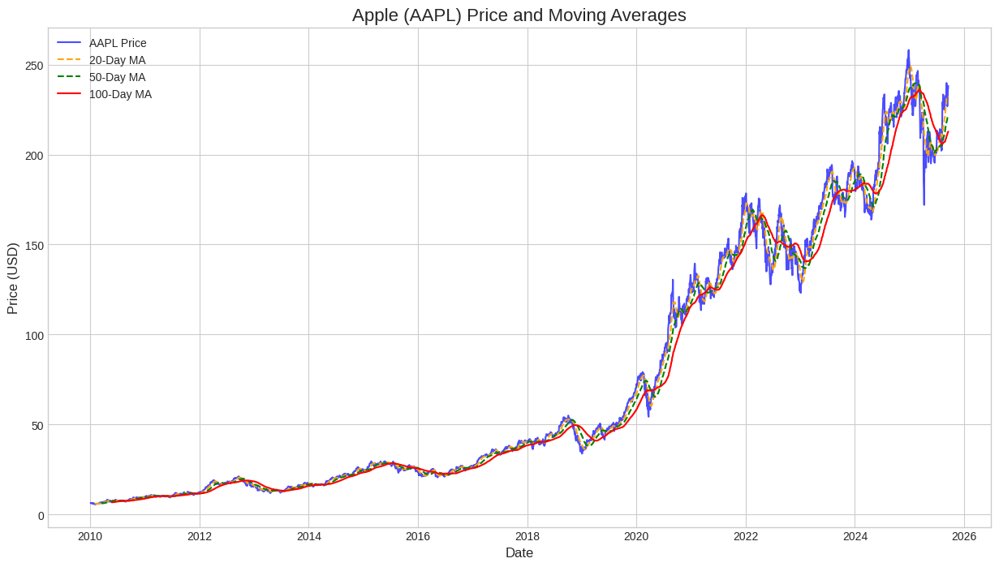
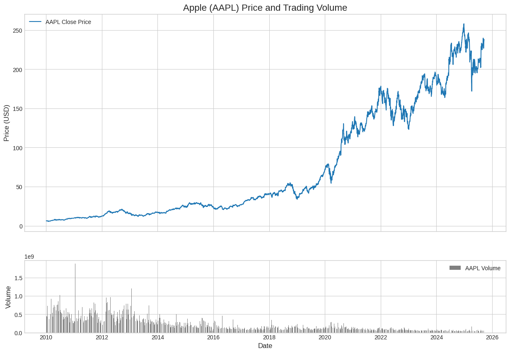
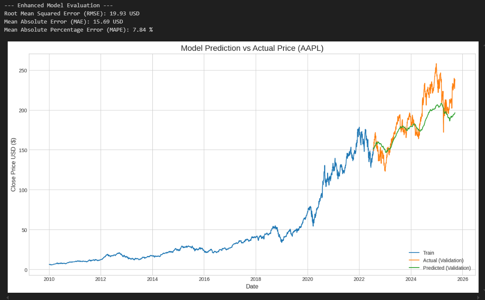

# 📈 Time Series Analysis and Stock Price Prediction using LSTM

## 📝 1. Project Overview

This project provides a comprehensive walkthrough of time series analysis and stock price prediction for major tech stocks (e.g., Apple - AAPL). The primary goal is to perform Exploratory Data Analysis (EDA) to understand stock behavior and then build a Long Short-Term Memory (LSTM) neural network to forecast future stock prices.

---

## 📊 2. About the Data

The data used in this project is historical stock market data fetched from **Yahoo Finance** using the `yfinance` Python library.

- **Tickers:** Apple (`AAPL`), Microsoft (`MSFT`), and Google (`GOOGL`)  
- **Time Period:** January 1, 2010 – Present 🗓️  
- **Features:** Open, High, Low, Close, Adjusted Close, Volume 💹  
- **Frequency:** Daily trading data  

---

## 🚀 3. Key Features

- **In-depth EDA:** Detailed analysis of price history, moving averages, trading volume, daily returns, and seasonal trends. 📈  
- **Data Visualization:** Clear and insightful visualizations using Matplotlib and Seaborn. 🎨  
- **LSTM Model:** Implementation of an LSTM model for time series forecasting. 🤖  
- **Data Source:** Fetches up-to-date stock data from Yahoo Finance using `yfinance`. 🌐  
- **Well-Documented Code:** Entire process contained within a single, easy-to-follow Jupyter Notebook. 📝  

---

## 🗂️ 4. Project Structure

├── .conda/ # (Ignored by Git) Conda environment folder
├── data/ # (Ignored by Git) Raw and processed data
├── notebooks/
│ └── Time-Series-Analysis-and-Stock-Price-Forecasting.ipynb
├── images/ # Plots and visualizations for README
├── models/ # Saved trained models
├── predictions/ # CSV predictions output
├── .gitignore
├── README.md # Project documentation
└── requirements.txt # Project dependencies


---

## ⚡ 5. How to Run This Project

1. **Clone the repository:**
    ```bash
    git clone https://github.com/AyaatMohammed/Stock-Time-Series-Analysis-and-Prediction-LSTM.git
    cd Stock-Time-Series-Analysis-and-Prediction-LSTM
     
    ```

2. **Create and activate the Conda environment:**
    ```bash
    conda create --name stock_predictor python=3.9
    conda activate stock_predictor
    pip install -r requirements.txt
    ```

3. **Launch Jupyter Notebook:**
    ```bash
    jupyter notebook notebooks/Time-Series-Analysis-and-Stock-Price-Forecasting.ipynb
    ```
---

## 📊 6. EDA Highlights

**Moving Average Analysis for a Single Stock (AAPL)**  


**Trading Volume Analysis**  



---

## 🤖 7. Project Outcome and Results

The primary outcome of this project is a trained LSTM model capable of forecasting stock prices. The model's performance was evaluated using several standard regression metrics, and the predictions were visualized against the actual prices.

### 📊 Model Performance Metrics

The model achieved the following results on the validation set:
- **Root Mean Squared Error (RMSE):** 19.93 USD  
- **Mean Absolute Error (MAE):** 15.69 USD  
- **Mean Absolute Percentage Error (MAPE):** 7.84 %  

These metrics indicate the average error of the model's predictions. For instance, a MAPE of 7.84% suggests that the model's predictions are, on average, within 7.84% of the actual stock price.

### 📈 Prediction vs. Actual Price

The plot below shows the model's predictions (green line) against the actual stock prices (orange line) on the validation data. This visualization confirms that the model successfully captured the overall trend of the stock price.

 

---

## 🛠️ 8. Technologies Used

- Python 3.9+  
- Pandas, NumPy, Scikit-learn  
- TensorFlow / Keras  
- Matplotlib, Seaborn  
- yfinance  
- Jupyter Notebook  

> ⚡ Note: Full environment setup is provided in `requirements.txt`.

---

## 👩‍💻 9. Author

**Ayaat Mohammed**  
AI & Data Science Specialist

---

## 📄 10. License

This project is licensed under the MIT License. See the [LICENSE](LICENSE) file for details.
